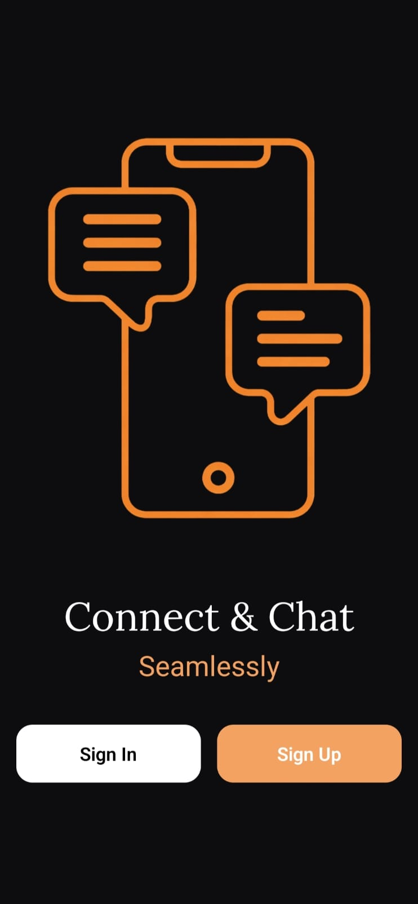
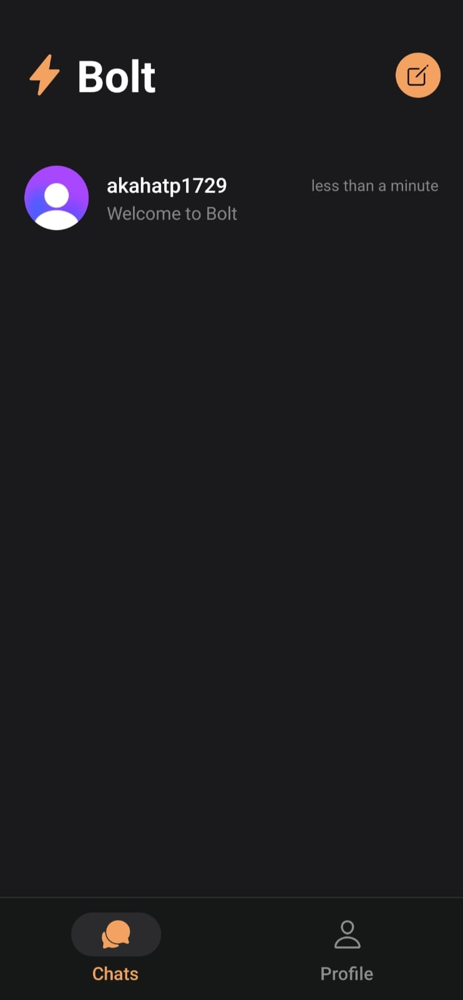
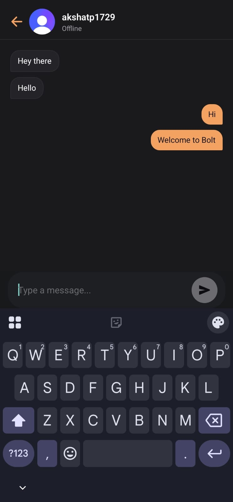
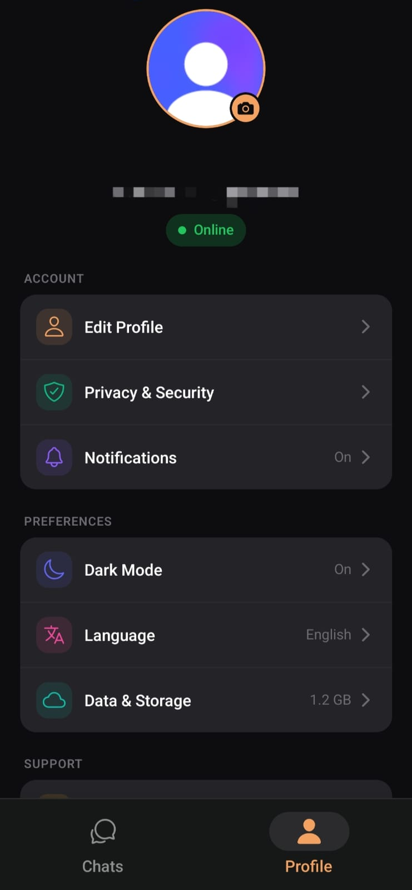

# ⚡ Bolt | Real-Time Messaging Platform

Bolt is a high-performance, minimalist style, full-stack mobile messaging application built to deliver a "zero-latency" user experience. By combining **Socket.io** for persistent connections and **TanStack Query** for intelligent state management, Bolt ensures that communication is not just real-time, but instantaneous.


---

## Key Features

* **Instantaneous Messaging:** Bi-directional communication using WebSockets for sub-100ms message delivery.
* **Modern Authentication:** Secure, sign-in and sign-up flows powered by **Clerk**.
* **Optimistic UI Updates:** Messages appear in the UI immediately upon sending, with background reconciliation and syncing handled by TanStack Query levying caches.
* **Persistent Sessions:** Robust session management that keeps users logged in across app restarts.
* **Clean & Crisp UI:** A minimalist, premium design focused on readability and smooth user experience.

---

## 🛠️ Technical Stack

### Frontend
- **React Native (Expo):** Cross-platform mobile development.
- **TanStack Query (v5):** Handles server-state, caching, and optimistic updates.
- **Clerk:** Identity management and JWT-based authentication.

### Backend
- **Bun.js:** Used as the fast JavaScript runtime to minimize startup time and overhead.
- **Express & Socket.io:** Powering the REST API and the WebSocket layer.
- **Node.js:** Core environment for scalable backend logic.

---

## Screenshots

| Onboarding Flow | Chats Page | Chat Interface | User Settings |
| :---: | :---: | :---: | :---: |
|  |  |  |  |

---

## Engineering Deep Dive

### 1. Handling Concurrency
One of the main challenges was syncing **Clerk’s** user registration with the custom backend database. I implemented a robust onboarding flow that resolves potential race conditions, ensuring that the Socket.io connection only initializes once the user identity is fully verified and synced.
The app initiates a backend sync upon returning to the foreground, keeping the displayed data up to date.
### 2. State Management Strategy
Instead of traditional Redux, I utilized **TanStack Query**. This allowed for:
- **Automatic Refetching:** Syncing message history when the app regains focus.
- **Message Deduplication:** Preventing the "double-message" glitch often seen in basic Socket.io implementations.

---

## Getting Started

### Prerequisites
- [Bun](https://bun.sh/) installed on your machine.
- [Expo Go](https://expo.dev/client) app on your mobile device.

### 1. Backend Setup
```bash
cd backend
bun install
# Add your environment variables to a .env file
# PORT, CLERK_API_KEY
bun run dev
```
### 2. Frontend Setup 
```bash
cd mobile
bun install
bun run start -c
```
